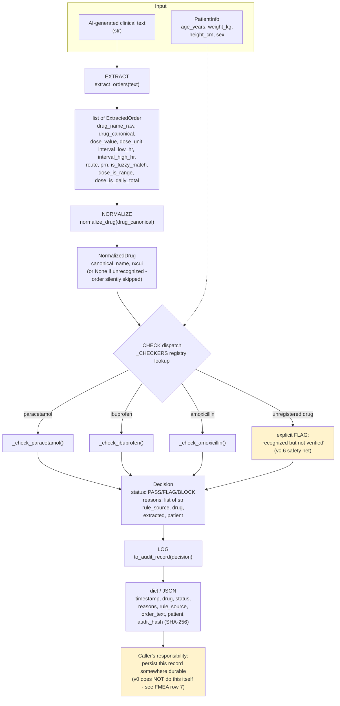

# Architecture

## Pipeline overview, with data shapes at each boundary

## What each stage does and doesn't do

| Stage | Input | Output | Does NOT do |
|---|---|---|---|
| **Extract** | Raw text | `list[ExtractedOrder]` | Never looks at `PatientInfo` - deliberately kept blind to patient data, see README's input-contract section |
| **Normalize** | `drug_canonical` string | `NormalizedDrug` or `None` | No fuzzy drug-concept matching beyond what Extract already resolved - a genuinely unrecognized drug simply isn't checked |
| **Check** (dispatch) | `ExtractedOrder` + `PatientInfo` | `Decision` | No cross-order reasoning - each `ExtractedOrder` is checked completely independently, even multiple orders from the same `check_order()` call |
| **Log** | `Decision` | `dict` (JSON-serializable) | Does not write anywhere - returns the record, storage is the caller's job |

## The one contract that constrains everything upstream
`check_order(text, patient)` assumes **exactly one patient** per call. This
isn't enforced by any type system - it's a documented contract (see
`check_order()`'s docstring and README). Nothing in this diagram can
detect a caller violating it; a multi-patient ward-round note passed in
one call will silently apply the single `patient` argument to every order
found, correctly for at most one of them.

## Extending this diagram
Adding drug #4 doesn't change this diagram's shape at all - it adds one
more branch under the CHECK dispatch box, registered in `_CHECKERS`
(see `engine.py`). If a new drug is added to `normalize.py`/`extract.py`
but its checker function isn't added to `_CHECKERS`, the "unregistered
drug" safety net branch (H4) fires automatically rather than the order
silently vanishing - this was a real gap in the dispatch design until v0.6.
